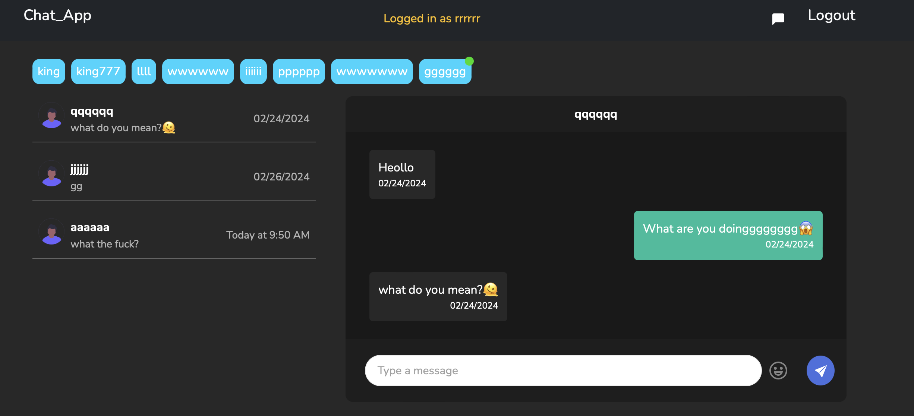
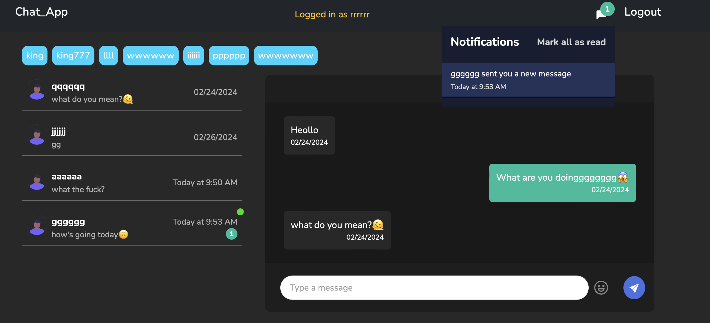
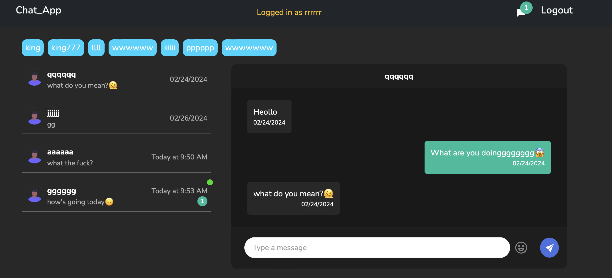

# Chat_App
使用聊天室與人進行即時交談

<br/>

## 功能
與他人線上聊天，可以確認即時訊息，並發送訊息或emoji給對方

首頁


通知處可以確認訊息


送出訊息及emoji


<br/>

## 使用之前...
請先確認有安裝node.js及npm

<br/>

## 複製專案
1. Fork
2. git clone 

<br/>

# Frontend
## 初始化
```
npm install // 安裝套件
```
## 啟動程式
```
npm run dev
```
## 看見下列訊息，則代表順利運行，打開瀏覽器進入到以下服務

```
 VITE v5.1.4  ready 
  ➜  Local:   http://localhost:5173/
```
<br/>

# Backend
## 初始化
```
npm install // 安裝套件
```

## 設定環境變數
請參照.env.example進行設置


## 啟動程式
```
npm run dev
```

## 若在啟動服務後看見此行訊息，則代表順利運行
```
App is listening on port 5000
```

<br/>

# Socket
## 初始化
```
npm install // 安裝套件
```

## 啟動程式
```
npm run dev
```

### =>  此服務沒有設置印出任何訊息，沒有訊息大概就是順利運行

<br/>

## 若欲中斷伺服器連線，請按

   ```
ctrl + c
```
<br/>

# 開發工具

## Frontend
- react 18.2.0
- react-bootstrap 2.10.1
- react-dom 18.2.0
- react-input-emoji 5.6.6
- react-router-dom 6.22.1
- bootstrap 5.3.3
- moment 2.30.1
- socket.io-client 4.7.4

## Backend
- Node.js 18.16.0
- Express 4.18.2 
- Mongoose 6.8.3
- bcrypt 5.1.1
- cors 2.8.5
- jsonwebtoken 9.0.2
- morgan 1.10.0
- validator 13.11.0

## Socket
- socket.io 4.7.4